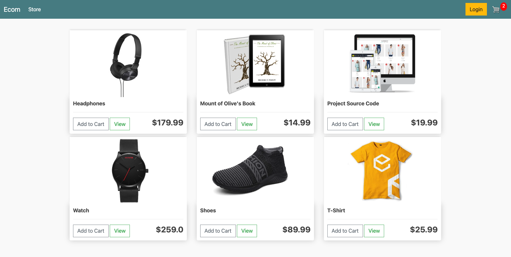

# Django eCommerce website

Basic django eCommerce website
Installation:

1. Clone repo: `git clone <repo_url>`
2. Install dependencies: `pip install -r requirements.txt`
3. Run server: `python manage.py runserver`

